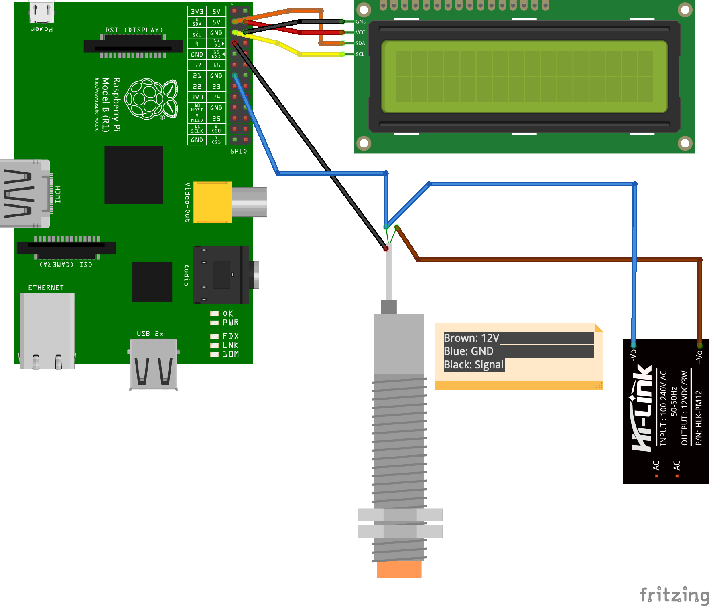

# raspberry_pi_capacity_sensor_i2c_lcd

Using an NPN Capacitive proximity sensor as an object counter with a Raspberry Pi and displaying the information to a 16x2 I2C LCD

**Instructions:**
- Connect the I2C LCD Display like this (check diagram): ***VCC*** -> Raspberry Pi 5V, ***GND*** -> Raspberry Pi GND, ***SDA*** -> Raspberry Pi SDA, ***SCL*** -> Raspberry Pi SCL
- Connect the capacitive sensor like this (check diagram): ***BROWN*** -> Power Supply 12v, ***BLUE*** -> Power Supply GND, ***BLUE*** -> Raspberry Pi GND Pin, ***BLACK*** -> Raspberry Pi GPIO 4
- Enable I2C in the Raspberry Pi: [tutorial here](https://learn.adafruit.com/adafruits-raspberry-pi-lesson-4-gpio-setup/configuring-i2c)
- Install required dependencies with: `sudo apt install gpiozero python-smbus`
- Run the script with: `python sensor.py`
